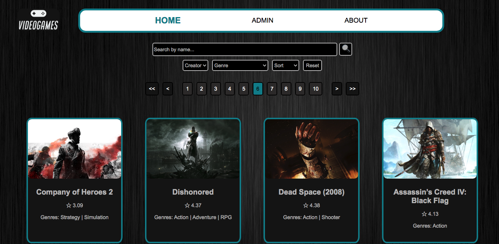

<!-- https://www.markdownguide.org/ -->
<!-- Dillinger -->

## Overview
In this project, created in 2023 as part of my studies at Soy Henry Bootcamp, I aimed to render videogames from a database and the rawg API, providing basic information about each game. The application allows users to explore videogames, apply filters and sorting options, view detailed information about any game, and even add new games to the database.
[](https://www.youtube.com/watch?v=trnyhUCFNfE&ab_channel=GastónDvoskin)
<!-- <iframe width="560" height="315" src="https://www.youtube.com/embed/trnyhUCFNfE?ab_channel=GastónDvoskin" frameborder="0" allowfullscreen></iframe> -->



## Goals of the Project
- Render videogames

Render videogames from my database and from rawg API. You will see the basic information of each videogame
In the Home component you will see all the videogames from my database and, for performance reasons, the first 150 videogames from rawg.
The results are shown by pages, displaying 15 videogames in each page.
- Filter and sort

Filter all videogames by name, including my database and the +800.000 from rawg API.
Filter videogames by creator and genres, combining both filters. These filters apply to all my database and the first 150 from rawg API.
Sort the videogame results based on selected criteria: alphabetically or by rating.
Reset all filters to their default settings.
- View more details

Access detailed information of any videogame, including the complete description, rating, release date, genres, platforms and id.
- Add a new videogame

Add a new videogame to my database.
The videogame will be created through a form in the Admin section.
Render the added videogame as any of the other ones.

## Used technologies
The project is built using the following technologies:
JavaScript, React, Redux, NodeJS, Express, and Sequelize.

## Requirements for local execution
To run the project locally, ensure the following steps are completed:
1. Install PostgreSQL.
2. Create a Database named 'Videogames'.
3. Create an account on the rawg API.
4. Inside the /api directory, create a .env file containing your credentials as shown below:
```shell
PORT = 3001
DB_USER = yourPostgresUser
DB_PASSWORD = yourPostgresPassword
DB_HOST = localhost
DB_PORT = yourDbPort
DB_NAME = videogames
API_KEY = yourApiKey
```
Replace yourPostgresUser, yourPostgresPassword, yourDbPort, and yourApiKey with your actual credentials.

## Installation
To install the necessary dependencies, use npm package manager:
- Inside /api: 
```shell
npm install
```
- Inside /client:
```shell
npm install
```

## Local Execution
To run the application locally, use the following commands:
- Inside /api: 
```shell
npm start
```
- Inside /client: 
```shell
npm start
```

## Contact
Thank you for visiting my webpage. 
If you have any questions or would like to provide feedback, please feel free to contact me via <https://www.linkedin.com/in/gaston-dvoskin> or <dvoskingaston@gmail.com>
